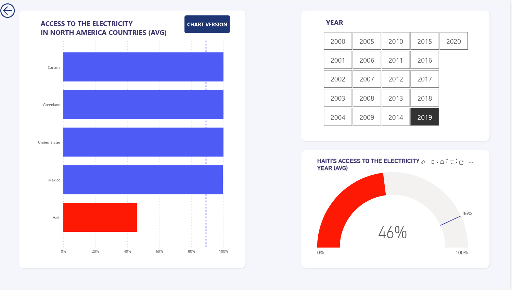

# SDG Correlation Dashboard – Haiti Case Study

This project explores the correlation between economic indicators and renewable energy access in Haiti, using real-world SDG datasets and Power BI dashboards to uncover actionable insights. It reflects my early interest in **data engineering** through structured data ingestion, transformation, and visualization processes.

## 🔍 Structure Overview

- **`datasets/`**  
  Contains raw `.csv` files on Haiti's GDP, electricity access, and green energy investments. These are foundational for data pipeline operations—simulating ingestion, cleaning, and transformation stages critical in Data Engineering.

- **`dashboards/`**  
  Includes:
  - **Power BI dashboards (`.pbix`)**:  
    - *Dashboard 1 – Text explanation*: Walkthrough of insights and correlations.  
    - *Dashboard 2 – Visual Dashboard*: Clean, user-friendly visualization of key SDG indicators.
  - **Exported dashboards (`.pdf`)**: Shareable versions of both dashboards for offline review and reporting.  

- **`analysis_proposal/`**  
  Contains a concise proposal explaining the rationale and structure of a correlational analysis (GDP ↔ Renewable Energy). This shows my ability to define data relationships and prepare data for exploration and modeling.

## 🚀 Relevance to Data Engineering

This project simulates a simplified but realistic **data pipeline lifecycle**:
- **Ingestion** from raw structured sources.
- **Transformation** through cleaning, merging, and preparation steps.
- **Delivery** via interactive dashboards and exportable reports.

Together, these outputs demonstrate a hands-on understanding of the **ETL process**, with a focus on **data clarity, structure, and stakeholder usability**—key traits of modern Data Engineering.

## Example pages

